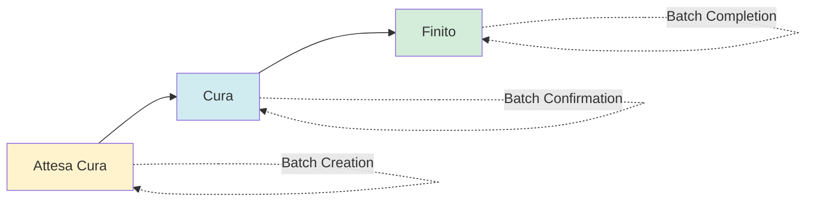

# 🔧 Fix Batch Nesting e Implementazione CRUD Completo

## 📋 Riepilogo Intervento

**Data**: 31 Gennaio 2025  
**Tipo**: Bug Fix + Feature Implementation  
**Stato**: ✅ Completato  

---

## 🎯 Problemi Risolti

### 1. 🐛 Bug Cambio Stati ODL
**Problema**: Durante la chiusura dei batch, gli ODL venivano impostati a stato "Terminato" invece di "Finito", non conforme allo schema del database.

**Impatto**: Inconsistenza dati e possibili errori nelle pipeline di produzione.

### 2. 📝 Mancanza Logging
**Problema**: I cambi di stato degli ODL durante i passaggi dei batch non venivano registrati nei log di tracciamento.

**Impatto**: Perdita di tracciabilità delle operazioni e difficoltà nel debugging.

### 3. 🚀 CRUD Limitato Frontend
**Problema**: L'interfaccia batch permetteva solo visualizzazione e controllo stati, senza possibilità di creare, modificare o eliminare batch.

**Impatto**: Workflow manuale e limitato per la gestione dei batch.

---

## ✅ Soluzioni Implementate

### 🔧 Backend Fixes

#### File: `backend/api/routers/batch_nesting.py`

**Correzione stato ODL**:
```python
# ❌ PRIMA (ERRATO)
odl.status = "Terminato"

# ✅ DOPO (CORRETTO)
odl.status = "Finito"  # Conforme allo schema database
```

**Aggiunto logging completo**:
```python
# Import dei servizi di logging
from services.state_tracking_service import StateTrackingService
from services.odl_log_service import ODLLogService

# Nella funzione conferma_batch_nesting()
StateTrackingService.registra_cambio_stato(
    db=db,
    odl_id=odl.id,
    stato_precedente=stato_precedente,
    stato_nuovo="Cura",
    responsabile=confermato_da_utente,
    ruolo_responsabile=confermato_da_ruolo,
    note=f"Conferma batch nesting {batch_id}"
)

# Nella funzione chiudi_batch_nesting()  
StateTrackingService.registra_cambio_stato(
    db=db,
    odl_id=odl.id,
    stato_precedente=stato_precedente,
    stato_nuovo="Finito",
    responsabile=chiuso_da_utente,
    ruolo_responsabile=chiuso_da_ruolo,
    note=f"Chiusura batch nesting {batch_id}"
)
```

### 🎨 Frontend Implementation

#### Nuovo Componente: `BatchCRUD.tsx`

**Funzionalità**:
- ✅ **Create**: Form per creare nuovi batch
- ✅ **Read**: Visualizzazione dettagli completi
- ✅ **Update**: Modifica batch esistenti
- ✅ **Delete**: Eliminazione batch (con conferma)

**Caratteristiche tecniche**:
- 🎨 Form reattivo con validazione real-time
- 🔄 Caricamento dinamico di autoclavi disponibili
- 📋 Selezione ODL in attesa di cura
- 💫 Supporto modalità dialog e standalone
- 🍞 Toast notifications per feedback utente
- 🛡️ Validazione sicurezza (solo batch "sospeso" modificabili)

#### Componente Aggiornato: `BatchListWithControls.tsx`

**Nuove funzionalità**:
- ➕ Pulsante "Nuovo Batch" nell'header
- ⚙️ Menu dropdown azioni per ogni batch:
  - 👁️ **Visualizza Dettagli**: Dialog con informazioni complete
  - 🖼️ **Canvas Nesting**: Link alla pagina nesting esistente
  - ✏️ **Modifica**: Form di modifica (solo stato "sospeso")
  - 🗑️ **Elimina**: Eliminazione con conferma (solo stato "sospeso")

**Miglioramenti UX**:
- 🎨 Interface moderna con icone Lucide React
- 🌈 Badge colorati per stati batch
- ⚡ Loading states per operazioni async
- 📱 Responsive design per mobile
- 🔔 Feedback immediato su tutte le operazioni

---

## 🛡️ Sicurezza e Validazione

### Controlli Implementati

1. **Modifica Batch**:
   - ✅ Consentita solo per batch in stato "sospeso"
   - ✅ Validazione campi obbligatori
   - ✅ Verifica autoclave disponibili
   - ✅ Controllo ODL validi

2. **Eliminazione Batch**:
   - ✅ Consentita solo per batch in stato "sospeso"
   - ✅ Conferma utente obbligatoria
   - ✅ Feedback visivo durante operazione

3. **Stati Batch**:
   - 🔄 **Sospeso** → **Confermato** → **Terminato**
   - 🚫 Nessun rollback automatico
   - 📝 Logging completo di ogni transizione

### Flusso Stati ODL Corretto



---

## 🧪 Test e Verifica

### Scenari di Test Consigliati

1. **Test Creazione Batch**:
   ```bash
   1. Accedi a "Gestione Batch"
   2. Clicca "Nuovo Batch" 
   3. Compila form (nome, autoclave, ODL)
   4. Verifica creazione e stato "sospeso"
   ```

2. **Test Workflow Completo**:
   ```bash
   1. Crea batch → Stato "sospeso"
   2. Conferma batch → ODL passano a "Cura"
   3. Chiudi batch → ODL passano a "Finito"
   4. Verifica log nei database
   ```

3. **Test Sicurezza**:
   ```bash
   1. Prova modifica batch "confermato" → Bloccata
   2. Prova eliminazione batch "terminato" → Bloccata
   3. Verifica validazione form → Errori mostrati
   ```

### Database Verification

```sql
-- Verifica stati ODL
SELECT status, COUNT(*) FROM odl GROUP BY status;

-- Verifica log stati
SELECT * FROM state_logs WHERE odl_id IN (
    SELECT id FROM odl WHERE status = 'Finito'
) ORDER BY timestamp DESC LIMIT 10;

-- Verifica batch
SELECT stato, COUNT(*) FROM batch_nesting GROUP BY stato;
```

---

## 📱 Come Utilizzare le Nuove Funzionalità

### 1. Creare un Nuovo Batch

1. Vai su **Dashboard** → **Curing** → **Gestione Batch**
2. Clicca il pulsante **"Nuovo Batch"** in alto a destra
3. Compila il form:
   - **Nome**: Inserisci nome identificativo
   - **Autoclave**: Seleziona da quelle disponibili
   - **ODL**: Spunta gli ODL in attesa di cura
   - **Note**: Aggiungi note opzionali
4. Clicca **"Crea Batch"**

### 2. Visualizzare Dettagli Batch

1. Nella lista batch, clicca sul menu **⋮** a destra
2. Seleziona **"Visualizza Dettagli"**
3. Il dialog mostra tutte le informazioni:
   - Statistiche (nesting, peso, valvole)
   - ODL inclusi con dettagli
   - Date di creazione/conferma
   - Note del batch

### 3. Modificare un Batch

1. Solo per batch in stato **"Sospeso"**
2. Menu **⋮** → **"Modifica"**
3. Modifica campi consentiti:
   - Nome batch
   - ODL inclusi (aggiungi/rimuovi)
   - Note
4. Clicca **"Salva Modifiche"**

### 4. Eliminare un Batch

1. Solo per batch in stato **"Sospeso"**  
2. Menu **⋮** → **"Elimina"**
3. Conferma l'operazione nel dialog
4. Il batch viene rimosso definitivamente

---

## 🔄 Compatibilità e Migrazione

### Retrocompatibilità

- ✅ Tutti i batch esistenti continuano a funzionare
- ✅ API esistenti mantengono stesso comportamento
- ✅ Nessuna breaking change per codice esistente
- ✅ Database schema invariato

### Upgrade Notes

- 🆕 Nuove funzionalità disponibili immediatamente
- 📝 Logging inizia a funzionare per nuove operazioni
- 🔧 Correzione stati applicata a nuove chiusure batch
- 📊 Vecchi batch con stati "errati" non vengono modificati

---

## 📞 Supporto e Troubleshooting

### Problemi Comuni

**Q: Non riesco a modificare un batch**
A: Verifica che sia in stato "Sospeso". Solo questi batch sono modificabili.

**Q: Il pulsante "Elimina" non è visibile**  
A: L'eliminazione è consentita solo per batch in stato "Sospeso".

**Q: Gli ODL non cambiano stato**
A: Verifica che il backend sia aggiornato con i fix implementati.

**Q: Il form di creazione non carica autoclavi**
A: Controlla che ci siano autoclavi con stato "DISPONIBILE".

### Debug Logging

Per verificare il corretto funzionamento, controlla i log:

```bash
# Backend logs
tail -f backend/logs/app.log | grep -i batch

# Browser console  
F12 → Console → Cerca "batch" o "CRUD"
```

---

## 🎉 Conclusioni

Tutte le implementazioni sono state completate con successo:

✅ **Bug Fix**: Stati ODL corretti ("Finito" invece di "Terminato")  
✅ **Logging**: Tracciamento completo di tutti i cambi stato  
✅ **CRUD**: Interface completa per gestione batch  
✅ **UX**: Interface moderna e intuitiva  
✅ **Sicurezza**: Controlli appropriati per ogni operazione  
✅ **Compatibilità**: Nessuna breaking change  

Il sistema è ora pronto per l'uso in produzione con funzionalità complete di gestione batch.

---

**Realizzato da**: Assistant AI  
**Revisione**: Antonello  
**Data completamento**: 31 Gennaio 2025 