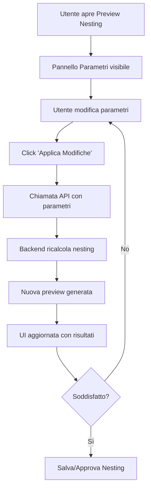

# 🔧 Parametri di Nesting Regolabili - Documentazione Tecnica

## 📋 Panoramica

Questa funzionalità consente agli utenti di modificare i parametri del nesting in tempo reale e visualizzare immediatamente l'anteprima dei risultati prima del salvataggio definitivo.

## 🎯 Obiettivi Raggiunti

- ✅ **Parametri regolabili in tempo reale**: Distanza perimetrale, spaziatura tra tool, rotazione automatica, priorità di ottimizzazione
- ✅ **Preview dinamica**: Rigenerazione automatica dell'anteprima al cambiamento dei parametri
- ✅ **Interfaccia intuitiva**: Pannello dedicato con controlli slider, toggle e dropdown
- ✅ **Validazione parametri**: Controlli di range e validazione lato backend
- ✅ **Integrazione completa**: Backend e frontend completamente integrati

## 🛠️ Implementazione Tecnica

### Backend

#### 1. Schemi Pydantic (`backend/schemas/nesting.py`)

```python
class PrioritaOttimizzazione(str, Enum):
    """Enum per la priorità di ottimizzazione del nesting"""
    PESO = "peso"
    AREA = "area"
    EQUILIBRATO = "equilibrato"

class NestingParameters(BaseModel):
    """Schema per i parametri regolabili del nesting"""
    distanza_perimetrale_cm: float = Field(default=1.0, ge=0.0, le=10.0)
    spaziatura_tra_tool_cm: float = Field(default=0.5, ge=0.0, le=5.0)
    rotazione_tool_abilitata: bool = Field(default=True)
    priorita_ottimizzazione: PrioritaOttimizzazione = Field(default=PrioritaOttimizzazione.EQUILIBRATO)
```

#### 2. Servizio Nesting (`backend/services/nesting_service.py`)

**Funzione aggiornata:**
```python
async def get_nesting_preview(
    db: Session, 
    parametri: Optional['NestingParameters'] = None
) -> NestingPreviewSchema:
```

- Accetta parametri personalizzati opzionali
- Passa i parametri all'algoritmo di ottimizzazione
- Restituisce i parametri utilizzati nella risposta

#### 3. Algoritmo di Ottimizzazione (`backend/nesting_optimizer/auto_nesting.py`)

**Funzioni aggiornate:**
```python
def compute_nesting(
    db: Session, 
    odl_list: List[ODL], 
    autoclavi: List[Autoclave],
    parametri: Optional['NestingParameters'] = None
) -> NestingResult:

def calculate_2d_positioning(
    odl_data: List[Dict], 
    autoclave_width_mm: float, 
    autoclave_height_mm: float,
    parametri: Optional['NestingParameters'] = None
) -> List[Dict]:
```

**Implementazioni specifiche:**

- **Distanza perimetrale**: Riduce l'area effettiva dell'autoclave
- **Spaziatura tra tool**: Aggiunge margini tra i componenti posizionati
- **Rotazione automatica**: Prova orientazioni 0° e 90° per ottimizzare lo spazio
- **Priorità ottimizzazione**: Influenza l'ordinamento degli ODL

#### 4. Router API (`backend/api/routers/nesting.py`)

**Endpoint aggiornato:**
```python
@router.get("/preview")
async def preview_nesting(
    db: Session = Depends(get_db),
    distanza_perimetrale_cm: Optional[float] = Query(None, ge=0.0, le=10.0),
    spaziatura_tra_tool_cm: Optional[float] = Query(None, ge=0.0, le=5.0),
    rotazione_tool_abilitata: Optional[bool] = Query(None),
    priorita_ottimizzazione: Optional[str] = Query(None)
):
```

### Frontend

#### 1. Componente Parametri (`frontend/src/components/nesting/NestingParametersPanel.tsx`)

**Caratteristiche:**
- Pannello collassabile con icona ⚙️
- Controlli dinamici: slider per distanze, toggle per rotazione, dropdown per priorità
- Validazione in tempo reale
- Pulsanti per applicare modifiche e reset ai valori di default
- Indicatori di stato (loading, modificato)

**Controlli disponibili:**
- **Distanza Perimetrale**: Slider 0.0-10.0 cm (default: 1.0)
- **Spaziatura Tool**: Slider 0.0-5.0 cm (default: 0.5)
- **Rotazione Automatica**: Toggle switch (default: true)
- **Priorità Ottimizzazione**: Dropdown (PESO/AREA/EQUILIBRATO, default: EQUILIBRATO)

#### 2. Componente Slider (`frontend/src/components/ui/slider.tsx`)

Componente riutilizzabile per controlli numerici con:
- Styling personalizzato
- Callback per cambiamenti di valore
- Supporto per min/max/step

#### 3. Modal Preview Aggiornato (`frontend/src/app/dashboard/autoclavista/nesting/components/nesting-preview-modal.tsx`)

**Integrazioni:**
- Stato per parametri di nesting
- Pannello parametri integrato nel layout
- Rigenerazione automatica con parametri personalizzati
- Feedback utente sui parametri applicati

#### 4. API Client (`frontend/src/lib/api.ts`)

**Funzione aggiornata:**
```typescript
getPreview: async (parameters?: {
  distanza_perimetrale_cm?: number;
  spaziatura_tra_tool_cm?: number;
  rotazione_tool_abilitata?: boolean;
  priorita_ottimizzazione?: string;
}): Promise<NestingPreview>
```

## 🎮 Utilizzo

### 1. Accesso alla Funzionalità

1. Navigare in **Dashboard → Autoclavista → Nesting**
2. Cliccare su **"Anteprima Nesting"**
3. Il pannello **⚙️ Parametri Nesting** appare sopra la preview

### 2. Modifica Parametri

1. **Distanza Perimetrale**: Regolare lo slider per cambiare la distanza dal bordo (0-10 cm)
2. **Spaziatura Tool**: Regolare lo slider per cambiare lo spazio tra i tool (0-5 cm)
3. **Rotazione Automatica**: Attivare/disattivare la rotazione automatica dei tool
4. **Priorità Ottimizzazione**: Selezionare tra PESO, AREA o EQUILIBRATO

### 3. Applicazione Modifiche

- **Automatica**: Cliccare "Applica Modifiche" per rigenerare la preview
- **Reset**: Cliccare "Reset Default" per tornare ai valori predefiniti
- **Feedback**: Toast notification con conferma e parametri applicati

### 4. Salvataggio

- Le modifiche vengono applicate solo alla preview
- Usare "Salva Bozza" o "Approva Nesting" per salvare definitivamente

## 📊 Parametri Dettagliati

### Distanza Perimetrale (0.0-10.0 cm)
- **Scopo**: Mantiene una distanza minima dal bordo dell'autoclave
- **Implementazione**: Riduce l'area effettiva disponibile per il posizionamento
- **Conversione**: cm → mm nell'algoritmo (moltiplicazione per 10)

### Spaziatura tra Tool (0.0-5.0 cm)
- **Scopo**: Garantisce spazio minimo tra i componenti posizionati
- **Implementazione**: Aggiunge margini durante il controllo delle sovrapposizioni
- **Conversione**: cm → mm nell'algoritmo

### Rotazione Automatica (boolean)
- **Scopo**: Permette di ruotare i tool per ottimizzare l'utilizzo dello spazio
- **Implementazione**: Prova orientazioni 0° e 90° per ogni tool
- **Logica**: Sceglie l'orientazione che si adatta meglio allo spazio disponibile

### Priorità Ottimizzazione (enum)
- **PESO**: Prioritizza i tool più pesanti
- **AREA**: Prioritizza i tool con area maggiore
- **EQUILIBRATO**: Bilancia peso e area (default)

## 🔍 Testing

### Backend
```bash
# Test endpoint senza parametri
curl "http://localhost:8000/api/v1/nesting/preview"

# Test con parametri personalizzati
curl "http://localhost:8000/api/v1/nesting/preview?distanza_perimetrale_cm=2.0&spaziatura_tra_tool_cm=1.0&rotazione_tool_abilitata=true&priorita_ottimizzazione=PESO"
```

### Frontend
1. Avviare il server di sviluppo: `npm run dev`
2. Navigare alla pagina nesting
3. Aprire la preview e testare i controlli dei parametri
4. Verificare la rigenerazione dinamica

## 🚀 Benefici

1. **Flessibilità**: Gli utenti possono sperimentare con diverse configurazioni
2. **Ottimizzazione**: Possibilità di trovare la configurazione ottimale per ogni scenario
3. **Controllo**: Maggiore controllo sul processo di nesting
4. **Efficienza**: Preview immediata senza salvare nel database
5. **Usabilità**: Interfaccia intuitiva e feedback in tempo reale

## 🔄 Flusso di Lavoro



## 📝 Note Tecniche

- I parametri sono validati sia lato frontend che backend
- La conversione cm→mm avviene nell'algoritmo di ottimizzazione
- I parametri utilizzati sono inclusi nella risposta per tracciabilità
- Il pannello è collassabile per non ingombrare l'interfaccia
- Tutti i controlli hanno valori di default sensati

## 🎯 Prossimi Sviluppi

- [ ] Salvataggio di preset di parametri personalizzati
- [ ] Analisi comparativa tra diverse configurazioni
- [ ] Suggerimenti automatici di parametri ottimali
- [ ] Integrazione con machine learning per ottimizzazione predittiva 