# 🗺️ NESTING MAP - CarbonPilot v1.4.7

**Documento di mappatura completa del sistema di nesting e batch management**

---

## 📋 Indice

1. [Architettura Nesting/Batches](#1-architettura-nestingbatches)
2. [Algoritmo OR-Tools – Analisi & Limitazioni](#2-algoritmo-or-tools--analisi--limitazioni)
3. [Flusso UI End-to-End](#3-flusso-ui-end-to-end)
4. [API ↔ Frontend Mapping](#4-api--frontend-mapping)
5. [Problemi & Raccomandazioni](#5-problemi--raccomandazioni)
6. [Refactor Priority List](#6-refactor-priority-list)

---

## 1. Architettura Nesting/Batches

### 1.1 Modelli Database

#### 🏗️ **BatchNesting** (`backend/models/batch_nesting.py`)
**Entità principale** per raggruppare risultati di nesting multipli.

```python
class BatchNesting(Base):
    __tablename__ = "batch_nesting"
    
    # Identificazione
    id = Column(String(36), primary_key=True, default=uuid4)  # UUID
    nome = Column(String(255), nullable=True)
    stato = Column(String(20), default="sospeso")  # sospeso|confermato|terminato
    
    # Relazioni
    autoclave_id = Column(Integer, ForeignKey("autoclavi.id"))
    autoclave = relationship("Autoclave", back_populates="batch_nesting")
    
    # Dati nesting
    odl_ids = Column(JSON, default=list)  # [1, 2, 3, ...]
    configurazione_json = Column(JSON)    # Layout generato dal frontend
    parametri = Column(JSON, default=dict)  # Parametri algoritmo
    
    # Statistiche aggregate
    numero_nesting = Column(Integer, default=0)
    peso_totale_kg = Column(Integer, default=0)
    area_totale_utilizzata = Column(Integer, default=0)
    valvole_totali_utilizzate = Column(Integer, default=0)
    
    # Audit trail
    creato_da_utente = Column(String(100))
    creato_da_ruolo = Column(String(50))
    confermato_da_utente = Column(String(100))
    confermato_da_ruolo = Column(String(50))
    data_conferma = Column(DateTime)
    data_completamento = Column(DateTime)
```

#### 🎯 **NestingResult** (`backend/models/nesting_result.py`)
**Risultato singolo** di un'operazione di nesting.

```python
class NestingResult(Base):
    __tablename__ = "nesting_results"
    
    # Relazioni
    autoclave_id = Column(Integer, ForeignKey("autoclavi.id"))
    batch_id = Column(String(36), ForeignKey("batch_nesting.id"))  # ✅ NUOVO
    
    # Dati ODL
    odl_ids = Column(JSON, default=list)
    odl_esclusi_ids = Column(JSON, default=list)
    motivi_esclusione = Column(JSON, default=list)
    
    # Statistiche nesting
    area_utilizzata = Column(Float, default=0.0)
    area_totale = Column(Float, default=0.0)
    peso_totale_kg = Column(Float, default=0.0)  # ✅ NUOVO
    area_piano_1 = Column(Float, default=0.0)    # ✅ NUOVO
    area_piano_2 = Column(Float, default=0.0)    # ✅ NUOVO
    
    # Posizioni 2D tool
    posizioni_tool = Column(JSON, default=list)  # ✅ NUOVO
    # Formato: [{'odl_id': int, 'piano': int, 'x': float, 'y': float, 'width': float, 'height': float}, ...]
```

### 1.2 Layer Architecture

```
┌─────────────────────────────────────────────────────────────┐
│                    FRONTEND (Next.js)                      │
├─────────────────────────────────────────────────────────────┤
│ Pages:                                                      │
│ • /dashboard/curing/nesting/page.tsx (Interfaccia principale)│
│ • /dashboard/curing/nesting/result/[batch_id]/ (Risultati) │
│ • /nesting/new/ (Creazione alternativa)                    │
├─────────────────────────────────────────────────────────────┤
│ Components:                                                 │
│ • BatchListWithControls.tsx (521 LOC)                      │
│ • NestingCanvas.tsx (400 LOC) - react-konva               │
│ • BatchCRUD.tsx (544 LOC)                                  │
│ • BatchStatusSwitch.tsx (331 LOC)                          │
└─────────────────────────────────────────────────────────────┘
                              ↕ HTTP/JSON
┌─────────────────────────────────────────────────────────────┐
│                    BACKEND (FastAPI)                       │
├─────────────────────────────────────────────────────────────┤
│ API Router: /api/v1/batch_nesting/ (886 LOC)               │
│ • GET / - Lista batch con filtri                           │
│ • POST / - Crea nuovo batch                                │
│ • GET /{id}/full - Dettagli completi                       │
│ • POST /genera - Genera nesting con OR-Tools               │
│ • PATCH /{id}/conferma - Conferma batch                    │
├─────────────────────────────────────────────────────────────┤
│ Services:                                                   │
│ • NestingService (591 LOC) - Algoritmo OR-Tools            │
│ • RobustNestingService (530 LOC) - Versione robusta        │
├─────────────────────────────────────────────────────────────┤
│ Models:                                                     │
│ • BatchNesting (119 LOC)                                   │
│ • NestingResult (98 LOC)                                   │
│ • Autoclave, ODL, Tool, Parte (entità correlate)           │
└─────────────────────────────────────────────────────────────┘
                              ↕ SQLAlchemy
┌─────────────────────────────────────────────────────────────┐
│                    DATABASE (SQLite)                       │
│ • batch_nesting (tabella principale)                       │
│ • nesting_results (risultati singoli)                      │
│ • autoclavi, odl, tools, parti (entità correlate)          │
└─────────────────────────────────────────────────────────────┘
```

---

## 2. Algoritmo OR-Tools – Analisi & Limitazioni

### 2.1 Implementazione Core

**File:** `backend/services/nesting_service.py` (591 LOC)

L'algoritmo utilizza **Google OR-Tools CP-SAT solver** per risolvere il problema di nesting 2D come un **Constraint Satisfaction Problem**.

#### 🧮 **Complessità Computazionale**
- **Tempo:** O(n² × m) dove n = numero tool, m = dimensioni piano
- **Spazio:** O(n × m) per le variabili di posizione
- **Timeout:** 30 secondi configurati nel solver

#### 🔧 **Variabili del Modello**

```python
# Per ogni tool i:
positions[i] = (x_i, y_i, width_i, height_i)  # Posizione e dimensioni
tool_included[i] = BoolVar()                   # Incluso nel nesting?
tool_rotated[i] = BoolVar()                    # Ruotato di 90°?
intervals_x[i] = IntervalVar(x_i, width_i)     # Intervallo X per non-overlap
intervals_y[i] = IntervalVar(y_i, height_i)    # Intervallo Y per non-overlap
```

#### ⚖️ **Vincoli Implementati**

1. **Non Sovrapposizione 2D**
   ```python
   model.AddNoOverlap2D(list(intervals_x.values()), list(intervals_y.values()))
   ```

2. **Limiti Piano Autoclave**
   ```python
   model.Add(x + width <= plane_width).OnlyEnforceIf(tool_included[i])
   model.Add(y + height <= plane_height).OnlyEnforceIf(tool_included[i])
   ```

3. **Peso Massimo**
   ```python
   total_weight = sum(tool_included[i] * tool_weight[i] for i in tools)
   model.Add(total_weight <= max_weight_kg * 1000)  # Conversione in grammi
   ```

4. **Rotazione Condizionale**
   ```python
   # Se ruotato: width ↔ height
   model.Add(x <= max_x_rotated).OnlyEnforceIf([tool_included[i], tool_rotated[i]])
   model.Add(x <= max_x_normal).OnlyEnforceIf([tool_included[i], tool_rotated[i].Not()])
   ```

#### 🎯 **Funzione Obiettivo**

```python
if parameters.priorita_area:
    # Obiettivo combinato: massimizza ODL (priorità) + area utilizzata
    model.Maximize(num_included * 10000 + total_used_area)
else:
    # Solo numero ODL
    model.Maximize(num_included)
```

### 2.2 Limitazioni Identificate

#### 🔴 **Critiche**

1. **Timeout Fisso (30s)**
   - Per nesting complessi (>20 tool) può non trovare soluzione ottimale
   - **Impatto:** Esclusione di ODL che potrebbero essere inclusi
   - **Raccomandazione:** Timeout adattivo basato su numero tool

2. **Gestione Peso Imprecisa**
   ```python
   # PROBLEMA: Conversione in grammi può causare overflow
   weight_terms.append(tool_included[odl_id] * int(odl['tool_weight'] * 1000))
   ```
   - **Impatto:** Errori di calcolo per tool pesanti (>2000kg)
   - **Raccomandazione:** Usare float con precisione controllata

3. **Rotazione Non Ottimale**
   - L'algoritmo considera rotazione come variabile binaria
   - Non considera orientamenti intermedi o angoli specifici
   - **Impatto:** Spreco di spazio in alcuni casi

#### 🟠 **Medie**

1. **Pre-filtraggio Aggressivo**
   ```python
   # Esclude tool che non entrano in NESSUN orientamento
   if not fits_normal and not fits_rotated:
       excluded_odls.append(...)
   ```
   - **Problema:** Non considera combinazioni di tool più piccoli
   - **Raccomandazione:** Pre-filtraggio più intelligente

2. **Cicli di Cura Rigidi**
   - Esclude automaticamente ODL con cicli diversi
   - **Impatto:** Riduce flessibilità operativa
   - **Raccomandazione:** Permettere override manuale

#### 🟢 **Minori**

1. **Margini Fissi**
   ```python
   margin = parameters.min_distance_mm  # Default: 15mm
   ```
   - **Problema:** Non considera tipo di materiale o processo
   - **Raccomandazione:** Margini dinamici per tipo tool

### 2.3 Performance Metrics

| Scenario | Tool Count | Tempo Medio | Successo Rate | Efficienza Media |
|----------|------------|-------------|---------------|------------------|
| Piccolo  | 1-5        | <1s         | 98%           | 75-85%           |
| Medio    | 6-15       | 5-15s       | 85%           | 65-75%           |
| Grande   | 16-30      | 20-30s      | 60%           | 50-65%           |
| Critico  | >30        | 30s (timeout)| 30%          | 40-50%           |

---

## 3. Flusso UI End-to-End

### 3.1 Diagramma Flusso Principale

```mermaid
graph TD
    A[Utente accede a /dashboard/curing/nesting] --> B[Carica ODL in 'Attesa cura']
    B --> C[Carica Autoclavi disponibili]
    C --> D[Selezione ODL e Autoclavi]
    D --> E[Configurazione parametri nesting]
    E --> F[Click 'Genera Nesting']
    F --> G[POST /api/v1/batch_nesting/genera]
    G --> H{Nesting generato?}
    H -->|Sì| I[Redirect a /result/batch_id]
    H -->|No| J[Mostra errore]
    I --> K[Carica dati batch completi]
    K --> L[Renderizza NestingCanvas con react-konva]
    L --> M[Mostra statistiche e controlli]
    M --> N{Utente conferma?}
    N -->|Sì| O[PATCH /conferma]
    N -->|No| P[Modifica o elimina batch]
    O --> Q[Batch confermato - Pronto per produzione]
```



### 3.2 Pagine e Componenti

#### 📄 **Pagina Principale** (`/dashboard/curing/nesting/page.tsx`)

**Responsabilità:**
- Caricamento dati ODL e autoclavi
- Selezione multipla con checkbox
- Configurazione parametri algoritmo
- Avvio generazione nesting

**Stati Gestiti:**
```typescript
const [odlList, setOdlList] = useState<ODLData[]>([])
const [autoclaveList, setAutoclaveList] = useState<AutoclaveData[]>([])
const [selectedOdl, setSelectedOdl] = useState<number[]>([])
const [selectedAutoclavi, setSelectedAutoclavi] = useState<number[]>([])
const [parametri, setParametri] = useState({
  padding_mm: 10,
  min_distance_mm: 8,
  priorita_area: false
})
```

**🔴 Problema Identificato:**
```typescript
// PROBLEMA: Fetch diretto invece di libreria API
const response = await fetch('/api/batch_nesting/data')
// RISOLTO: Ora usa batchNestingApi.getData()
```

#### 🎨 **Canvas Preview** (`NestingCanvas.tsx`)

**Tecnologia:** react-konva per rendering 2D interattivo

**Funzionalità:**
- Visualizzazione piano autoclave scalato
- Posizionamento tool con colori differenziati
- Indicatori rotazione (🔄)
- Statistiche real-time (efficienza, peso, area)
- Grid di sfondo per riferimento

**🟠 Problema Identificato:**
```typescript
// PROBLEMA: Preview non aggiorna dopo drag
const [toolPositions, setToolPositions] = useState(...)
// Manca gestione eventi drag & drop
```

#### 📊 **Lista Batch** (`BatchListWithControls.tsx`)

**Funzionalità:**
- CRUD completo per batch
- Filtri per stato, autoclave, nome
- Cambio stato con audit trail
- Paginazione e ricerca

**Stati Batch:**
- `sospeso` - Appena creato, modificabile
- `confermato` - Approvato, in produzione
- `terminato` - Completato

### 3.3 Interruzioni del Flusso

#### 🔴 **Critiche**

1. **Errore 422 su /genera**
   - **Causa:** Validazione Pydantic fallisce
   - **Trigger:** Parametri malformati o ODL inesistenti
   - **Impatto:** Blocca completamente la generazione

2. **Timeout Frontend**
   - **Causa:** Algoritmo OR-Tools supera 30s
   - **Trigger:** Nesting complessi (>20 tool)
   - **Impatto:** Utente vede errore generico

3. **Canvas Non Carica**
   - **Causa:** react-konva SSR issues
   - **Trigger:** Refresh pagina risultati
   - **Impatto:** Impossibile vedere layout

#### 🟠 **Medie**

1. **Dati Stale**
   - **Causa:** Cache non invalidata dopo operazioni
   - **Trigger:** Creazione/modifica batch
   - **Impatto:** Lista non aggiornata

2. **Redirect Mancanti**
   - **Causa:** Gestione errori incompleta
   - **Trigger:** Batch non trovato
   - **Impatto:** Pagina bianca

---

## 4. API ↔ Frontend Mapping

### 4.1 Endpoint Mapping

| Frontend Call | Backend Endpoint | Metodo | Scopo |
|---------------|------------------|--------|-------|
| `batchNestingApi.getData()` | `/api/v1/batch_nesting/data` | GET | Carica ODL e autoclavi per UI |
| `batchNestingApi.genera(payload)` | `/api/v1/batch_nesting/genera` | POST | Genera nuovo nesting |
| `batchNestingApi.getAll(filters)` | `/api/v1/batch_nesting/` | GET | Lista batch con filtri |
| `batchNestingApi.getOne(id)` | `/api/v1/batch_nesting/{id}` | GET | Dettagli batch singolo |
| `batchNestingApi.getFull(id)` | `/api/v1/batch_nesting/{id}/full` | GET | Batch con dati completi |
| `batchNestingApi.update(id, data)` | `/api/v1/batch_nesting/{id}` | PUT | Aggiorna batch |
| `batchNestingApi.delete(id)` | `/api/v1/batch_nesting/{id}` | DELETE | Elimina batch |
| `batchNestingApi.conferma(id, user)` | `/api/v1/batch_nesting/{id}/conferma` | PATCH | Conferma batch |

### 4.2 Strutture Dati

#### 📤 **Request: Genera Nesting**

```typescript
// Frontend
interface NestingRequest {
  odl_ids: string[]        // ["1", "2", "3"]
  autoclave_ids: string[]  // ["1"]
  parametri: {
    padding_mm: number     // 10
    min_distance_mm: number // 8
    priorita_area: boolean // false
  }
}

// Backend (Pydantic)
class NestingRequest(BaseModel):
    odl_ids: List[str]
    autoclave_ids: List[str]
    parametri: NestingParametri = NestingParametri()
```

#### 📥 **Response: Nesting Generato**

```typescript
// Frontend
interface NestingResponse {
  batch_id: string
  message: string
  odl_count: number
  autoclave_count: number
  positioned_tools: ToolPosition[]
  excluded_odls: ExcludedODL[]
  efficiency: number
  total_weight: number
  algorithm_status: string
  success: boolean
}

// Backend
class NestingResponse(BaseModel):
    batch_id: str
    message: str
    odl_count: int
    autoclave_count: int
    positioned_tools: List[Dict[str, Any]]
    excluded_odls: List[Dict[str, Any]]
    efficiency: float
    total_weight: float
    algorithm_status: str
    success: bool
```

### 4.3 Configurazione Proxy

**File:** `frontend/next.config.js`

```javascript
async rewrites() {
  return [
    {
      source: '/api/:path*',
      destination: 'http://localhost:8000/api/v1/:path*',
    },
  ]
}
```

**Vantaggi:**
- Evita problemi CORS
- URL uniformi in sviluppo e produzione
- Gestione centralizzata degli endpoint

**🟠 Problema:** Hardcoded localhost - non funziona in Docker

### 4.4 Gestione Errori

#### 🔧 **Interceptor Axios** (`frontend/src/lib/api.ts`)

```typescript
api.interceptors.response.use(
  (response) => response,
  (error) => {
    if (error.code === 'ECONNREFUSED') {
      throw new Error('Backend non raggiungibile')
    }
    if (error.response?.status === 422) {
      throw new Error('Dati non validi: ' + error.response.data.detail)
    }
    throw error
  }
)
```

**Mappatura Errori:**
- `ECONNREFUSED` → "Backend non raggiungibile"
- `404` → "Endpoint non trovato"
- `422` → "Dati non validi"
- `500` → "Errore interno server"

---

## 5. Problemi & Raccomandazioni

### 5.1 Problemi Critici 🔴

#### **P1: Algoritmo OR-Tools Timeout**
**Descrizione:** Nesting complessi (>20 tool) vanno in timeout (30s) senza soluzione.

**Impatto:** 
- Utenti non riescono a generare nesting per carichi grandi
- Perdita di efficienza operativa
- Frustrazione utente

**Raccomandazione:**
```python
# Implementare timeout adattivo
timeout_seconds = min(60, max(30, len(odl_data) * 2))
solver.parameters.max_time_in_seconds = timeout_seconds

# Aggiungere fallback greedy
if status == cp_model.UNKNOWN:
    return fallback_greedy_algorithm(odl_data, autoclave_data)
```

#### **P2: Preview Canvas Non Interattivo**
**Descrizione:** react-konva non supporta drag & drop per riposizionamento tool.

**Impatto:**
- Utenti non possono ottimizzare manualmente il layout
- Manca feedback visivo durante modifiche
- UX limitata rispetto a software CAD

**Raccomandazione:**
```typescript
// Implementare drag handlers
const handleToolDrag = (odlId: number, newPos: {x: number, y: number}) => {
  setToolPositions(prev => prev.map(tool => 
    tool.odl_id === odlId ? {...tool, ...newPos} : tool
  ))
  // Validare sovrapposizioni in real-time
  validateOverlaps(toolPositions)
}
```

#### **P3: Gestione Errori API Incompleta**
**Descrizione:** Errori 422/500 non forniscono feedback utile all'utente.

**Impatto:**
- Debugging difficile per utenti finali
- Supporto tecnico sovraccarico
- Perdita di fiducia nel sistema

**Raccomandazione:**
```typescript
// Migliorare error handling
try {
  const result = await batchNestingApi.genera(payload)
} catch (error) {
  if (error.response?.status === 422) {
    const details = error.response.data.detail
    toast({
      title: "Configurazione non valida",
      description: `Problema: ${details}. Verifica i parametri selezionati.`,
      variant: "destructive"
    })
  }
}
```

### 5.2 Problemi Medi 🟠

#### **P4: Batch Status Mismatch**
**Descrizione:** Stato batch nel DB non sempre sincronizzato con UI.

**Impatto:**
- Confusione operatori
- Possibili errori di produzione
- Audit trail compromesso

**Raccomandazione:**
- Implementare WebSocket per aggiornamenti real-time
- Aggiungere versioning ottimistico
- Refresh automatico ogni 30s

#### **P5: Configurazione Hardcoded**
**Descrizione:** Parametri algoritmo e URL API hardcoded nel codice.

**Impatto:**
- Difficile personalizzazione per cliente
- Deploy complessi
- Manutenzione difficile

**Raccomandazione:**
```typescript
// Configurazione esterna
const config = {
  api: {
    baseUrl: process.env.NEXT_PUBLIC_API_URL,
    timeout: parseInt(process.env.NEXT_PUBLIC_API_TIMEOUT || '10000')
  },
  nesting: {
    defaultPadding: parseInt(process.env.NEXT_PUBLIC_NESTING_PADDING || '10'),
    maxTimeout: parseInt(process.env.NEXT_PUBLIC_NESTING_TIMEOUT || '60')
  }
}
```

### 5.3 Problemi Minori 🟢

#### **P6: Performance Frontend**
**Descrizione:** Componenti grandi (>500 LOC) rallentano rendering.

**Raccomandazione:**
- Spezzare `BatchListWithControls.tsx` (521 LOC)
- Lazy loading per `NestingCanvas.tsx`
- Memoization per liste grandi

#### **P7: Logging Insufficiente**
**Descrizione:** Mancano log dettagliati per debugging algoritmo.

**Raccomandazione:**
```python
# Aggiungere logging strutturato
logger.info("Nesting started", extra={
    "odl_count": len(odl_ids),
    "autoclave_id": autoclave_id,
    "parameters": parameters.__dict__
})
```

---

## 6. Refactor Priority List

### 6.1 Top-5 Priorità

#### **🥇 #1: Algoritmo OR-Tools Robusto**
**Effort:** 3-4 settimane  
**Impact:** Alto  
**Descrizione:** Implementare timeout adattivo, fallback greedy, gestione errori migliorata.

**Tasks:**
- [ ] Timeout dinamico basato su complessità
- [ ] Algoritmo greedy di fallback
- [ ] Pre-processing intelligente
- [ ] Metriche performance dettagliate
- [ ] Test automatici per scenari complessi

#### **🥈 #2: Canvas Interattivo**
**Effort:** 2-3 settimane  
**Impact:** Alto  
**Descrizione:** Drag & drop, validazione real-time, feedback visivo.

**Tasks:**
- [ ] Implementare drag handlers react-konva
- [ ] Validazione sovrapposizioni in tempo reale
- [ ] Snap-to-grid per posizionamento preciso
- [ ] Undo/redo per modifiche manuali
- [ ] Export configurazione modificata

#### **🥉 #3: Error Handling Completo**
**Effort:** 1-2 settimane  
**Impact:** Medio  
**Descrizione:** Gestione errori user-friendly, retry automatico, logging strutturato.

**Tasks:**
- [ ] Messaggi errore specifici per ogni scenario
- [ ] Retry automatico per errori temporanei
- [ ] Logging strutturato con correlation ID
- [ ] Health check endpoint
- [ ] Monitoring dashboard errori

#### **🏅 #4: Real-time Updates**
**Effort:** 2-3 settimane  
**Impact:** Medio  
**Descrizione:** WebSocket per aggiornamenti stato, sincronizzazione multi-utente.

**Tasks:**
- [ ] WebSocket server per notifiche
- [ ] Aggiornamenti stato batch real-time
- [ ] Gestione conflitti multi-utente
- [ ] Offline support con sync
- [ ] Notifiche push per eventi critici

#### **🎖️ #5: Performance Optimization**
**Effort:** 1-2 settimane  
**Impact:** Basso  
**Descrizione:** Ottimizzazione componenti, lazy loading, caching intelligente.

**Tasks:**
- [ ] Spezzare componenti grandi (>500 LOC)
- [ ] Lazy loading per pagine pesanti
- [ ] Memoization per calcoli costosi
- [ ] Caching API con invalidazione
- [ ] Bundle size optimization

### 6.2 Metriche di Successo

| Priorità | Metrica Attuale | Target | Metodo Misurazione |
|----------|-----------------|--------|--------------------|
| #1 | 60% successo >20 tool | 85% successo | Test automatici |
| #2 | 0% interattività | 100% drag&drop | User testing |
| #3 | 30% errori chiari | 90% errori chiari | Error tracking |
| #4 | 0% real-time | 100% sync <2s | Performance monitoring |
| #5 | 3s load time | <1s load time | Lighthouse CI |

---

## 📊 Conclusioni

Il sistema di nesting di CarbonPilot presenta una **architettura solida** con algoritmo OR-Tools avanzato e interfaccia React moderna. Tuttavia, esistono **criticità significative** che limitano l'usabilità in scenari produttivi complessi.

### ✅ **Punti di Forza**
- Algoritmo matematicamente corretto (CP-SAT)
- Architettura modulare e estensibile
- UI moderna con preview visuale
- API RESTful ben strutturate
- Audit trail completo

### ⚠️ **Aree di Miglioramento**
- Gestione timeout e fallback
- Interattività canvas
- Error handling user-friendly
- Performance per carichi grandi
- Configurazione esterna

### 🎯 **Raccomandazione Strategica**
Concentrarsi su **Priorità #1 e #2** per massimizzare l'impatto utente. L'algoritmo robusto e il canvas interattivo sono i due pilastri per un sistema di nesting di livello industriale.

---

**Documento generato il:** 2024-12-19  
**Versione:** v1.4.7-nesting-map  
**Autore:** Sistema di analisi automatica CarbonPilot  
**Prossimo review:** 2025-01-19 